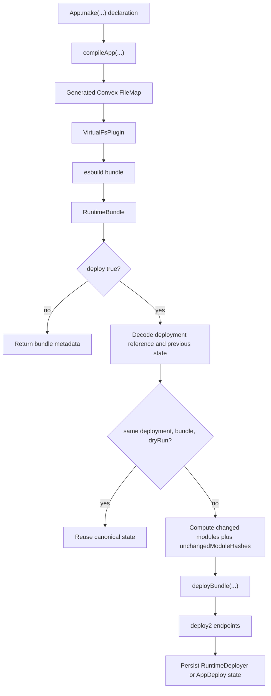

> Status: this page documents the current implementation contract for the
> experimental runtime deployer. It is intentionally more detailed than the
> user-facing runtime guide because the runtime deployer owns protocol, bundle,
> and persisted-state behavior that the normal Convex CLI usually hides.

The experimental runtime path exists for one reason: deploy a typed Alchemy
Convex app without writing generated Convex app files to disk.

That changes the product contract. The files deployer can be explained as
"generate files, then let Convex CLI deploy them." The runtime deployer has to
explain how Alchemy:

- compiles the DSL app into a virtual Convex project,
- bundles that virtual project into Convex deploy2 modules,
- decides whether a push is necessary,
- reuses prior deployed module hashes safely,
- calls Convex deploy2 endpoints directly, and
- records enough Alchemy state to make the next deploy deterministic.

This document is the internals PRD for that surface.

Read each section as a handoff:

| Before: Convex CLI | After: Alchemy Convex Runtime |
| --- | --- |
| The CLI owns file discovery, bundling, deploy2 request construction, deploy sequencing, and most stateful shortcuts. Alchemy can treat it as a command-shaped black box. | The runtime owns those same responsibilities in-process. Alchemy must make each hidden CLI behavior explicit, typed, testable, and safe to persist. |

## Runtime product requirement

Alchemy Convex Runtime must preserve the same authoring model as Alchemy Convex
while changing the deploy sink.

| Requirement | Before: Convex CLI | After: Alchemy Convex Runtime |
| --- | --- | --- |
| Authoring model | Users write a normal `convex/` source tree. The CLI discovers schema, functions, components, and config from files. | Users write `App.make(...)`, schemas, groups, HTTP routes, component installs, and migrations through `@alchemy/convex`. The runtime compiles that declaration into the virtual source tree. |
| Generated files | Generated app files exist on disk, can be inspected, and are part of the CLI's normal source discovery path. | Generated app files stay in memory. The runtime treats the generated `FileMap` as the Convex project. |
| Deploy boundary | Alchemy shells out to `convex deploy` or delegates to the files deployer, so the CLI constructs deploy2 payloads. | Alchemy calls the runtime deploy2 client directly. Request shape, endpoint order, and state reuse are Alchemy-owned. |
| Boundary checks | The CLI validates many inputs internally and returns command errors. | Runtime source props, bundles, deploy2 requests, responses, and persisted state are decoded before use. |
| Idempotence | The CLI and backend decide what to upload from the files and push request context. | Same-bundle Alchemy state skips pushes. Changed bundles send only changed modules when prior deployed hashes prove unchanged backend state. |
| Failure behavior | Most failures are surfaced through CLI stderr/stdout and exit codes. | Invalid source, malformed state, bad deploy references, protocol drift, and schema failures stop in typed runtime layers before unsafe state reuse. |

The result should feel like normal Alchemy: the stack describes desired state,
the provider decides whether anything changed, and the output can be reused by
downstream resources. The unusual part is that "desired state" includes a
Convex application bundle, not just cloud resource properties.

## Mental model



There are two related deployer products:

- `RuntimeDeployer` is the high-level deployer used by
  `@alchemy/convex-runtime`'s `App(...)` wrapper.
- `AppDeploy` is the direct resource that pushes an already-built runtime
  bundle.

Both share the same bundle model and deploy2 client. The high-level wrapper
adds the ergonomic `source: { app }` entrypoint and stores deployer-owned state
inside the generic `alchemy/Convex.App` resource boundary.

| Step | Before: Convex CLI | After: Alchemy Convex Runtime |
| --- | --- | --- |
| Source project | A physical `convex/` directory plus `convex.json`. | A generated in-memory `FileMap` plus selected real user modules from `projectRoot`. |
| Bundle creation | CLI runs its internal bundler from the physical project. | `AppBundle` and `AppBundler` run esbuild against the virtual filesystem. |
| Deploy decision | CLI decides what to upload during the command. | Runtime compares decoded Alchemy state, deployment identity, `bundleHash`, and dry-run mode. |
| Push | CLI sends deploy2 requests. | `DeployApi` sends the same endpoint family with decoded inputs and outputs. |
| Stored shortcut | CLI/backend state is opaque to Alchemy. | Alchemy persists deployment-scoped bundle and module-hash state for the next plan. |

## Package ownership

The ownership shift is the main reason this page exists.

| Concern | Before: Convex CLI owns | After: Alchemy Runtime owns |
| --- | --- | --- |
| Source discovery | Walking the physical Convex app tree. | Building and validating the generated `FileMap`, then resolving real user imports. |
| Bundling | Convex CLI's internal esbuild pipeline. | `@alchemy/convex-runtime/Bundler` and `VirtualFsPlugin`. |
| Deploy protocol | CLI deploy2 request and endpoint orchestration. | `@alchemy/convex-runtime/DeployApi`. |
| Deployment state | CLI/backend internals. | Decoded `RuntimeDeployerState` or `AppDeployAttributes` in Alchemy state. |
| User-facing infra graph | Outside the CLI. | `alchemy/Convex` resources, providers, bindings, credentials, and high-level app wrapper. |

| Package or module | Responsibility |
| --- | --- |
| `@alchemy/convex` | Owns the DSL declarations and generated file-map compiler. |
| `@alchemy/convex-runtime/AppBundle` | Owns runtime bundle schemas, bundle options, config ingestion, bundle hashes, and bundle metadata. |
| `@alchemy/convex-runtime/Bundler` | Owns esbuild integration, the virtual filesystem plugin, module classification, source-map options, and dependency inference. |
| `@alchemy/convex-runtime/DeployApi` | Owns deploy2 request/response schemas and HTTP transport. |
| `@alchemy/convex-runtime/AppDeploy` | Owns direct deployment of a runtime bundle to a Convex deployment. |
| `@alchemy/convex-runtime` `RuntimeDeployer` | Owns high-level runtime deployer behavior for `Convex.App`. |
| `alchemy/Convex` | Owns Convex projects, deployments, credentials, generated-file deployers, and the generic high-level `Convex.App` resource wrapper. |

The key boundary is that `@alchemy/convex` produces application source data,
while `@alchemy/convex-runtime` decides how to turn that source data into a
deployable Convex bundle.

## Public entrypoints

The runtime package exports the pieces needed for three use cases.

| Use case | Before: Convex CLI | After: Alchemy Convex Runtime |
| --- | --- | --- |
| Deploy an app | Run `convex deploy` against files. | Use high-level `App(...)` with `source: { app, deploy: true, adminKey }`. |
| Inspect a bundle | Use CLI-generated request/debug output or generated files. | Use `AppBundle(...)` to build a decoded `RuntimeBundle` without deploy2 I/O. |
| Push a prepared bundle | Not a first-class CLI resource in Alchemy state. | Use `AppDeploy(...)` to push an already-built bundle and persist deploy output. |

### High-level app deployment

```ts
import { App } from "@alchemy/convex-runtime";

const backend = yield* App("Backend", {
  deployment,
  source: {
    app,
    deploy: true,
    adminKey,
  },
});
```

This is the intended user entrypoint. It wraps `alchemy/Convex.App` with the
runtime deployer.

### Bundle-only compilation

```ts
import { AppBundle } from "@alchemy/convex-runtime";

const bundle = yield* AppBundle("Bundle", {
  app,
  projectRoot,
  generateSourceMaps: true,
});
```

Bundle-only mode is useful for tests, inspection, and future dev-loop work. It
does not require an admin key or a deploy2 client.

### Direct bundle deployment

```ts
import { AppDeploy } from "@alchemy/convex-runtime";

const deployed = yield* AppDeploy("Deploy", {
  bundle,
  deployment,
  dryRun: false,
});
```

This resource is lower-level than the high-level `App(...)` wrapper. It is the
right target when callers already have a runtime bundle and want to test or
customize deployment orchestration directly.

## Runtime source schema

The high-level runtime deployer accepts a `RuntimeSource`.

| Runtime field | Before: Convex CLI source | After: Runtime source |
| --- | --- | --- |
| `app` | The CLI reads authored modules from the Convex app directory. | The runtime receives the `@alchemy/convex` app declaration and compiles generated modules from it. |
| `deploy` | Running `convex deploy` implies a push. Other CLI commands may only inspect or codegen. | `true` pushes through deploy2. Omitted or false returns bundle metadata only. |
| `adminKey` | The CLI resolves credentials from its environment/profile/config flow. | Required only for `deploy: true`, stored as `Redacted`, and decoded before deploy2 I/O. |
| `projectRoot` | The current project directory is the CLI's source, config, and dependency root. | Used for `convex.json`, module resolution, source maps, and dependency lookup. |
| `generateSourceMaps` | CLI bundling controls source maps internally. | Runtime option controls source-map generation for runtime modules. |
| `includeSourcesContent` | CLI config controls whether source maps embed source content. | Runtime option or supported `convex.json` field controls embedded source content. |
| `externalPackages` | CLI reads Node externalization config from Convex config. | Runtime option accepts package names or `"*"` for generated Node-runtime bundles. |
| `nodeVersion` | CLI reads Node runtime version from Convex config. | Runtime option or supported `convex.json` field forwards the version to deploy2. |

The runtime source decoder intentionally rejects CLI-only options such as
`verbose` and `largeIndexDeletionCheck`. Those options make sense for the
Convex CLI, but accepting them in the runtime deployer would imply support that
does not exist.

## Bundle pipeline

The bundle pipeline is deterministic and schema-heavy.

| Pipeline step | Before: Convex CLI | After: Alchemy Convex Runtime |
| --- | --- | --- |
| Source materialization | Read the physical `convex/` tree. | Compile `App.make(...)` to an in-memory `FileMap`. |
| Config | Read `convex.json` as part of CLI project loading. | Read only supported runtime fields from `projectRoot/convex.json`; explicit runtime props override them. |
| Module resolution | Resolve files from disk. | Resolve generated files through `VirtualFsPlugin`, then real user imports from disk. |
| Bundling | CLI esbuild pipeline creates deploy2 modules. | Runtime esbuild pipeline creates `RuntimeBundle` modules and metadata. |
| Dependency metadata | CLI infers deploy2 `nodeDependencies`. | Runtime infers dependency names/versions for externalized Node packages. |
| Validation | CLI validates internally. | Runtime decodes every bundle boundary with Effect Schema before deploy. |

### 1. Compile the app declaration

| Before: Convex CLI | After: Alchemy Convex Runtime |
| --- | --- |
| The source project already exists as files. CLI discovery starts from the `convex/` directory and treats authored files as the source of truth. | The source project is produced by the shared Alchemy compiler. It turns the DSL declaration into generated Convex modules, generated wrappers, app definition modules, schema modules, component config modules, and metadata. |

The runtime does not treat generated files as special strings. The generated file
map is the source project. Every later step consumes that project through typed
data structures.

### 2. Read supported Convex config

| Before: Convex CLI | After: Alchemy Convex Runtime |
| --- | --- |
| The CLI reads `convex.json` as part of project loading and may understand more fields over time. | The runtime reads only the supported runtime fields from `projectRoot`, then lets explicit runtime options override them. Unknown future keys are ignored. |

The supported runtime fields are:

- `functions`
- `node.externalPackages`
- `node.nodeVersion`
- `bundler.includeSourcesContent`

Malformed known fields fail before generated wrapper compilation or deploy2 I/O.

This keeps runtime behavior close to Convex CLI behavior without making every
future Convex config key a breaking change for Alchemy.

### 3. Mount a virtual Convex filesystem

| Before: Convex CLI | After: Alchemy Convex Runtime |
| --- | --- |
| esbuild resolves modules from files that already exist on disk. | `VirtualFsPlugin` creates an esbuild namespace for generated files. Generated modules resolve from the in-memory file map; user-authored handlers still resolve from real source files on disk. |

Relative imports inside the virtual namespace follow Convex-style candidates:

- exact path
- `.ts`
- `.tsx`
- `.js`
- `.jsx`
- `/index.ts`
- `/index.tsx`
- `/index.js`
- `/index.jsx`

The plugin gives esbuild enough information to bundle generated app modules as if
they existed on disk, while still letting normal project dependencies resolve
from `projectRoot`.

### 4. Bundle changed modules

| Before: Convex CLI | After: Alchemy Convex Runtime |
| --- | --- |
| The CLI classifies and bundles isolate versus Node runtime modules internally. | The runtime bundles generated isolate modules and generated Node-runtime modules itself. Node-runtime detection follows generated runtime semantics, including `"use node"` in generated or user-imported code. |

`externalPackages` applies only to generated Node-runtime modules. Isolate
modules keep package imports bundled. The runtime also keeps Alchemy and Convex
helper packages bundled so `nodeDependencies` describes user external
dependencies, not runtime implementation details.

The wildcard form, `externalPackages: ["*"]`, externalizes package imports but
does not externalize absolute app files, handler modules, generated virtual
files, or runtime helper packages.

### 5. Infer node dependencies

| Before: Convex CLI | After: Alchemy Convex Runtime |
| --- | --- |
| The CLI infers `nodeDependencies` from the project and externalization rules before deploy2. | For externalized Node packages, the runtime walks ancestor `node_modules` directories from the project root and records package names and versions. |

It also expands allowlisted peer and optional dependencies in the same spirit as
Convex CLI behavior. Missing optional dependencies are skipped. Present packages
with malformed metadata fail clearly, because a bad version in deploy2 state is
not safe to guess.

### 6. Build the runtime bundle

| Before: Convex CLI | After: Alchemy Convex Runtime |
| --- | --- |
| The CLI holds the deployable bundle internally long enough to produce deploy2 requests. | The runtime stores the deployable shape as a decoded `RuntimeBundle`, so tests, direct deploy resources, and high-level app deployers can all share it. |

The resulting `RuntimeBundle` contains:

- the generated file map,
- the functions directory,
- app definition metadata,
- schema metadata,
- changed runtime modules,
- unchanged module hashes when provided by a deployer,
- local and package-backed component definitions,
- component implementation modules,
- inferred Node dependencies,
- optional `nodeVersion`,
- `udfServerVersion`,
- function manifest,
- size accounting, and
- `bundleHash`.

The schema enforces invariants before callers can use the bundle:

- module paths are unique,
- changed modules and unchanged hashes do not overlap,
- definition and schema singleton paths do not overlap with runtime modules,
- component definition paths are unique,
- app definition dependencies are unique,
- function identities are unique,
- node dependency names are unique,
- total size equals isolate size plus Node size, and
- deploy2 JSON values are real JSON values, not functions, symbols, or non-finite numbers.

## Bundle hash contract

`bundleHash` is the runtime deployer's coarse idempotence key.

| Before: Convex CLI | After: Alchemy Convex Runtime |
| --- | --- |
| The CLI/backend can decide whether a push changed from its own source scan and request context. Alchemy usually sees only command success or failure. | The runtime needs an explicit state key. `bundleHash` changes when deploy-relevant runtime inputs change and lets Alchemy skip same-bundle deploy2 I/O safely. |

It changes when deploy-relevant runtime inputs change, including generated file
contents, runtime module source, source maps, component definition state,
component implementation state, inferred node dependencies, and `nodeVersion`.

Source-map-only changes intentionally count as module changes. Convex module
identity covers both source and source map, so Alchemy must not omit a module
from deploy2 just because the authored handler source is otherwise identical.

## State model

The runtime persists different state depending on which entrypoint is used.

| Concern | Before: Convex CLI | After: Alchemy Convex Runtime |
| --- | --- | --- |
| What Alchemy stores | Usually command/resource output, not CLI-internal deploy shortcuts. | Deployment identity, bundle hash, dry-run status, deploy2 result payloads, and successful module hashes. |
| Where state lives | Outside the CLI, Alchemy cannot rely on hidden CLI cache details. | High-level state lives in `RuntimeDeployerState`; direct deployment state lives in `AppDeployAttributes`. |
| Why it matters | The next CLI command can rediscover source from disk. | The next runtime deploy needs decoded persisted state to decide whether it can skip or shrink deploy2 uploads. |

| State shape | Where it lives | Purpose |
| --- | --- | --- |
| `RuntimeDeployerState` | Inside high-level `Convex.App` deployer state | Lets the high-level runtime deployer skip or incrementally push future deploys. |
| `AppDeployAttributes` | Output state of direct `Convex.AppDeploy` resource | Lets direct bundle deploys skip or incrementally push future deploys. |

Both include the same deployment identity and deploy result core:

- deployment name,
- canonical deployment URL,
- deployed bundle hash,
- deploy timestamp,
- dry-run flag,
- deploy2 result payloads, and
- deployed module hashes for successful non-dry-run pushes.

The direct `AppDeploy` attributes also keep app manifest, index diff, auth diff,
and component diffs from deploy2 results so state consumers can inspect what the
server accepted.

## State trust rules

Persisted state is useful only after it is decoded.

| Before: Convex CLI | After: Alchemy Convex Runtime |
| --- | --- |
| The CLI owns its own state/cache trust boundary. Alchemy does not interpret it. | Alchemy interprets persisted deployer state, so it must decode, tag-check, canonicalize, and deployment-scope that state before it can affect uploads. |

The runtime follows these rules:

1. Decode previous state before using it for idempotence.
2. Ignore foreign high-level deployer state when switching deployers.
3. Reject malformed state with the runtime deployer's own tag before deploy2 side effects.
4. Reuse state only when deployment name, canonical deployment URL, bundle hash, and dry-run mode all match.
5. Never treat dry-run state as committed backend state.
6. Never reuse deployed module hashes across a different deployment identity.
7. Backfill legacy same-bundle non-dry-run state with module hashes when the prior state predates that field.
8. Prune stale module hashes from dry-run state and deleted modules.

Those rules are the main protection against a bad DX failure mode: omitting
source from deploy2 because stale Alchemy state says a module is unchanged.

## Incremental module reuse

Convex deploy2 supports sending two module sets:

- `changedModules`: modules whose source or source map should be uploaded.
- `unchangedModuleHashes`: modules already deployed on the target backend.

Alchemy can use `unchangedModuleHashes` only when prior successful state proves
the exact backend already has those modules.

| Before: Convex CLI | After: Alchemy Convex Runtime |
| --- | --- |
| The CLI can compute changed and unchanged deploy2 modules from its own bundle and backend context. | The runtime can omit module source only when prior decoded Alchemy state proves that exact deployment already accepted the same module hash. |

The runtime computes module hashes by runtime path, environment, source, and
source map. When a module hash matches the prior deployed hash for the same
deployment identity, the runtime moves it from `changedModules` to
`unchangedModuleHashes`. New, changed, deleted, or source-map-changed modules
stay out of the unchanged set.

The persisted next state records the complete deployed module hash set after a
successful non-dry-run push. Dry runs do not persist deployed module hashes.

## Deploy2 protocol model

The runtime's deploy2 client is a small protocol layer with strict schemas.

| Concern | Before: Convex CLI | After: Alchemy Convex Runtime |
| --- | --- | --- |
| Request construction | CLI builds deploy2 payloads internally. | `startPushRequestFromBundle(...)` builds deploy2 payloads from decoded `RuntimeBundle` data. |
| Endpoint order | CLI calls deploy2 endpoints in the correct order. | `deployBundle(...)` owns the endpoint sequence explicitly. |
| Encoding | CLI chooses brotli JSON or plain JSON per endpoint. | `DeployApi` models the same split and tests it. |
| Drift handling | CLI changes with Convex releases. | Runtime schemas and request-capture parity tests catch drift against the installed CLI. |

| Endpoint | Used when | Encoding | Runtime behavior |
| --- | --- | --- | --- |
| `/api/deploy2/start_push` | Non-dry-run deploy start | Brotli JSON | Starts a real push and returns schema-change metadata. |
| `/api/deploy2/evaluate_push` | Dry-run deploy start | Brotli JSON | Evaluates the push without committing it. |
| `/api/deploy2/wait_for_schema` | Dry-run and non-dry-run | Plain JSON | Polls schema readiness until complete, failed, race, or timeout. |
| `/api/deploy2/finish_push` | Non-dry-run only | Brotli JSON | Commits a previously-started push. Sends `message: null`. |
| `/api/deploy2/report_push_completed` | Non-dry-run best-effort telemetry | Plain JSON | Reports completion spans. Failure is logged and ignored. |

The runtime forwards W3C trace context when present so captured requests can be
correlated during tests and debugging.

### Deploy request shape

`startPushRequestFromBundle(...)` builds the deploy2 request from a
`RuntimeBundle` and deployment reference. The request contains:

| Before: Convex CLI | After: Alchemy Convex Runtime |
| --- | --- |
| The CLI translates files, config, component definitions, and dependency metadata into the deploy2 `start_push` envelope. | The runtime constructs the same envelope from `RuntimeBundle`, validates no path collisions, and rejects malformed JSON-like values before HTTP I/O. |

- admin key,
- dry-run flag,
- functions metadata,
- app definition source and dependencies,
- schema source,
- changed modules,
- unchanged module hashes,
- UDF server version,
- component definitions,
- node dependencies,
- optional node version, and
- codegen flag.

Before the request can be sent, the decoder verifies that changed module paths
and unchanged module paths do not overlap and that singleton definition or schema
paths do not collide with runtime module paths.

### Deploy sequence

`deployBundle(...)` owns the endpoint order.

| Mode | Before: Convex CLI | After: Alchemy Convex Runtime |
| --- | --- | --- |
| Non-dry-run | Start the push, wait for schema, finish the push, and report completion. | Same sequence through `start_push`, `wait_for_schema`, `finish_push`, and best-effort `report_push_completed`. |
| Dry-run | Evaluate the push and wait for schema without committing. | Same sequence through `evaluate_push` and `wait_for_schema`; no finish, no report, no deployed module hashes. |

For non-dry-run:

1. `start_push`
2. `wait_for_schema`
3. `finish_push`
4. `report_push_completed` best effort

For dry-run:

1. `evaluate_push`
2. `wait_for_schema`

Dry-run mode intentionally does not finish the push, does not report completion,
and does not persist deployed module hashes.

## Schema wait behavior

Schema waiting maps Convex statuses into typed runtime failures.

| Before: Convex CLI | After: Alchemy Convex Runtime |
| --- | --- |
| The CLI polls schema readiness and renders command-level errors. | The runtime polls `wait_for_schema` and maps statuses into typed failures: validation failed, race detected, or timed out. |

| Status | Runtime result |
| --- | --- |
| `complete` | Continue the deploy. |
| `failed` | Fail with `SchemaValidationFailed` and preserve the server reason. |
| `raceDetected` | Fail with `SchemaRaceDetected`. |
| repeated `inProgress` | Fail with `SchemaWaitTimedOut` after the configured attempt limit. |

The default schema wait loop is intentionally long enough for real deploys, but
tests inject attempts and clients so the behavior is deterministic without live
Convex credentials.

## Deployment reference validation

The runtime deployer validates deployment references before deploy2 I/O.

| Before: Convex CLI | After: Alchemy Convex Runtime |
| --- | --- |
| The CLI obtains and validates deployment target information through its credential and project resolution flow. | The runtime receives deployment name, deployment URL, and admin key as inputs, so it validates identity strings, origin-only URLs, and redacted admin keys before any request. |

| Field | Validation |
| --- | --- |
| `deploymentName` | Non-blank string with no whitespace-only or control-character values. |
| `deploymentUrl` | HTTP or HTTPS origin only. No username, password, path, query, hash, whitespace, or control characters. |
| `adminKey` | Non-blank redacted string with no whitespace-only or control-character values. |

Deployment URLs are canonicalized before they are stored in state, so
`https://example.convex.cloud/` and `https://example.convex.cloud` compare as the
same deployment origin.

## High-level RuntimeDeployer flow

The high-level deployer behaves like this:

| Phase | Before: Convex CLI | After: High-level runtime deployer |
| --- | --- | --- |
| Input | CLI command plus physical project files. | Decoded `RuntimeSource`, deployment reference, and optional previous deployer state. |
| Build | CLI bundles the project internally. | `bundleFromApp(source.app, source.options)` creates a decoded `RuntimeBundle`. |
| Idempotence | CLI/backend internals decide whether source must be uploaded. | Runtime compares previous state against deployment identity, bundle hash, and dry-run mode. |
| Persist | CLI state is opaque to Alchemy. | Runtime returns deployer-owned state to the generic `Convex.App` resource. |

```ts
const source = decodeRuntimeSource(input);

if (source.deploy === true) {
  const deployment = decodeRuntimeDeploymentReference(input.deployment);
  const previous = decodeRuntimeDeployerStateIfOwned(input.oldState);
  const bundle = yield* bundleFromApp(source.app, source.options);

  if (previousMatchesDeploymentBundleAndDryRun(previous, deployment, bundle)) {
    return reusePreviousStateOrBackfillModuleHashes(previous, bundle);
  }

  const deployBundleInput = maybeAttachUnchangedModuleHashes({
    bundle,
    previous,
    deployment,
  });

  const result = yield* deployBundle(deployBundleInput);
  return persistRuntimeDeployerState(result, bundle, deployment);
}

const bundle = yield* bundleFromApp(source.app, source.options);
return bundleOnlyResultWithoutDeployerState(bundle);
```

There are three important details in that pseudocode.

First, bundle-only mode does not need `DeployApi` and does not keep stale deployer
state, even if an admin key is present.

Second, same-bundle non-dry-run state can skip deploy2 I/O and still backfill
deployed module hashes for older state.

Third, deploy2 delta uploads are allowed only when previous successful state
matches the exact deployment identity.

## Direct AppDeploy flow

`AppDeploy` performs the same deployment reasoning as the high-level deployer,
but its state is the resource output itself.

| Phase | Before: Convex CLI | After: direct `AppDeploy` |
| --- | --- | --- |
| Input | Physical files and CLI options. | A decoded `RuntimeBundle`, deployment reference, dry-run flag, and previous resource output. |
| Reuse | CLI owns any internal reuse behavior. | Provider canonicalizes identity, validates old output, and reuses or backfills only same-bundle state. |
| Delete | The CLI does not model "delete this code deploy" as a cloud resource. | `delete` is a no-op; later deploys replace application code. |

The provider:

1. decodes the current bundle and prior output,
2. canonicalizes deployment identity,
3. returns existing state for same deployment, same bundle, and same dry-run,
4. backfills legacy same-bundle module hashes when safe,
5. prunes dry-run module hashes when old state accidentally contains them,
6. attaches unchanged module hashes when prior successful state proves them, and
7. calls `deployBundle(...)` only when the backend needs a new push.

`delete` is a no-op. Deploying application code is not a separate cloud resource
that can be safely deleted from a Convex deployment after the fact. A later
deploy should replace code; destroying the Alchemy stack should not attempt to
erase the deployment's application bundle.

## Bundle-only mode

When `source.deploy` is not `true`, the high-level runtime deployer is a pure
bundle producer.

| Before: Convex CLI | After: Alchemy Convex Runtime |
| --- | --- |
| Inspecting or generating deployable data usually goes through CLI-specific commands or debug output. | Bundle-only mode compiles and bundles the app in-process, returns metadata, and intentionally avoids deploy2 dependencies or stale deployer state. |

Bundle-only mode:

- compiles the app,
- reads supported runtime config,
- bundles modules,
- returns bundle metadata,
- avoids deploy2 I/O,
- does not require `adminKey`,
- does not require `DeployApi`, and
- drops stale runtime deployer state.

That last point is subtle. If a stack switches from `deploy: true` to
bundle-only mode, stale module hashes from a previous deploy must not keep
pretending the bundle-only result is committed backend state.

## Dry-run semantics

Dry-run mode is evaluative, not committal.

| Before: Convex CLI | After: Alchemy Convex Runtime |
| --- | --- |
| CLI dry-run evaluates a push and does not commit it. | Runtime dry-run calls `evaluate_push`, waits for schema, skips `finish_push`, skips completion telemetry, and refuses to persist deployed module hashes. |

The runtime sends the bundle to `evaluate_push`, waits for schema readiness, and
returns the evaluation result. It does not:

- call `finish_push`,
- call `report_push_completed`,
- persist deployed module hashes, or
- allow future deploys to treat dry-run state as uploaded backend source.

Same-bundle dry-run reconciliation can skip deploy2 I/O because the same dry-run
has already been evaluated. It still stays non-committal.

## Local backend role

`LocalBackend` is the runtime package's process-management surface for local
Convex development.

| Before: Convex CLI | After: Alchemy Convex Runtime |
| --- | --- |
| Local development can rely on the CLI watching physical Convex files and pushing them to a local or cloud target. | Runtime local development needs an in-process bundle-and-push loop because generated Convex files are not written to disk. |

It is intentionally injectable. Tests use fake process services; production
usage can start a local backend process, expose a local deployment URL and admin
key, and then point the high-level runtime deployer at that local target.

Local backend support matters because the runtime path has no generated
`convex/` directory for Convex CLI to watch. The future development loop is:

1. start or reuse a local backend,
2. compile and bundle the DSL app,
3. push through deploy2,
4. watch source inputs,
5. repeat with a changed runtime bundle.

The runtime deployer is therefore both a deployment engine and the foundation of
the intended local dev engine.

## Failure model

The runtime should fail before unsafe side effects whenever possible.

| Failure class | Before: Convex CLI | After: Alchemy Convex Runtime |
| --- | --- | --- |
| Invalid source | CLI validates physical files and reports command errors. | Decode app declarations, group names, and runtime options before bundling or deploy2 I/O. |
| Bundle failure | CLI esbuild failures appear as command failures. | Raise a bundle failure and leave previous deployed code untouched. |
| Bad deployment reference | CLI credential/project resolution rejects bad targets. | Reject invalid URLs, blank names, and missing admin keys before deploy2 I/O. |
| Malformed owned state | CLI owns its own cache/state shape. | Reject same-tag malformed Alchemy state before deploy2 I/O so state cannot cause source omission. |
| Foreign deployer state | Not usually visible to the CLI. | Ignore it and perform a full runtime deploy or bundle. |
| Protocol drift | Updating Convex CLI updates the protocol client. | Fail in the deploy2 client layer and trip request-capture tests. |
| Schema failure | CLI renders Convex schema failure output. | Surface `SchemaValidationFailed` with the server reason. |
| Schema race | CLI reports the race from deploy2. | Surface `SchemaRaceDetected`. |
| Schema timeout | CLI times out or reports wait failure. | Surface `SchemaWaitTimedOut`. |

The runtime does not try to hide these categories behind a single generic
"deploy failed" error. The DX goal is to make the next action obvious: fix
source, fix config, retry a race, or update the runtime protocol model.

## Test contract

The runtime is experimental, so the tests are the safety rails.

| Before: Convex CLI | After: Alchemy Convex Runtime |
| --- | --- |
| The official CLI is the implementation; Alchemy mainly verifies command integration. | Runtime tests must verify protocol parity, bundling, persisted state, deploy sequencing, local backend behavior, and every state shortcut that could omit source from deploy2. |

The focused runtime suite covers:

- deploy2 request schemas,
- deploy2 endpoint sequencing,
- Convex CLI request-capture parity,
- brotli versus JSON transport behavior,
- W3C trace context propagation,
- bundle hashes and size accounting,
- source-map and source-content options,
- Node-runtime inference,
- external package dependency inference,
- local and package-backed component definitions,
- recursive component dependency graphs,
- high-level deployer state reuse,
- direct `AppDeploy` state reuse,
- deployment-identity isolation,
- dry-run non-commit behavior,
- legacy state backfill,
- malformed state rejection,
- virtual filesystem resolution, and
- local backend lifecycle branches.

The larger Convex-family sweep also covers the DSL, generated-files deployer,
Confect adapter, and `alchemy/Convex` provider surfaces so runtime behavior is
tested with the same declarations used by the other modes.

## Why the feature remains experimental

The runtime deployer is not experimental because the code path is small or
untested. It is experimental because it depends on a direct protocol contract
that the Convex CLI normally owns.

| Before: Convex CLI | After: Alchemy Convex Runtime |
| --- | --- |
| Protocol ownership stays with Convex. Alchemy benefits from the CLI tracking backend changes. | Protocol ownership is shared by Alchemy's runtime implementation. Alchemy must track Convex CLI behavior and keep parity tests current. |

Known trade-offs:

- deploy2 can drift and require runtime updates,
- dashboard source views may show bundled output instead of authored modules,
- no `_generated/**` app files are written for inspection,
- debugging protocol failures requires runtime-level logs and tests,
- local dev needs runtime push behavior rather than Convex CLI file watching, and
- compatibility must be checked against the installed Convex CLI over time.

The files deployer stays the recommended default because it delegates more of
this surface to Convex CLI. The runtime deployer is for teams that explicitly
want zero generated Convex app files in the repo and are willing to carry the
experimental protocol cost.

## Implementation checklist

When changing runtime behavior, update all of these surfaces together:

| Before: Convex CLI changes | After: runtime changes |
| --- | --- |
| A Convex CLI update can adjust hidden bundling or deploy2 behavior in one package. | Alchemy changes must update schemas, bundler behavior, state reuse, direct and high-level deployers, parity tests, and docs together. |

1. Runtime schemas for source, bundle, deploy2, and state.
2. Bundler behavior and bundle hash inputs.
3. High-level `RuntimeDeployer` state reuse behavior.
4. Direct `AppDeploy` state reuse behavior.
5. Deploy2 request-capture parity tests.
6. Dry-run and non-dry-run endpoint sequencing tests.
7. Local backend tests if process behavior changes.
8. This internals document and the user-facing runtime guide.

Runtime DX is only good when those pieces move as one system.
